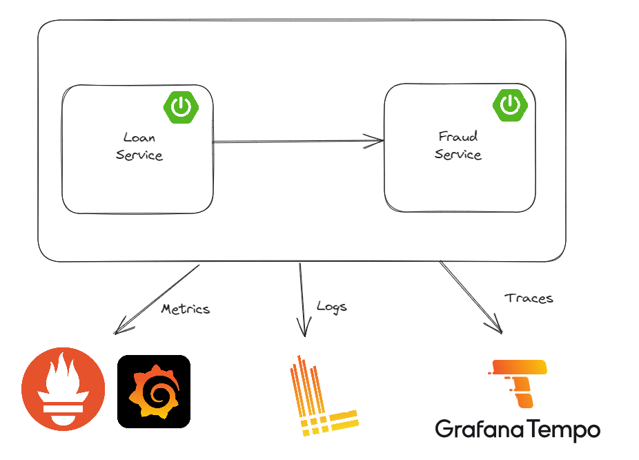

# Spring Boot 3 Observability with Grafana Stack

This project contains the source code for the [Spring Boot 3 Observability with Grafana Stack](https://youtu.be/PT2yZTBnUwQ?feature=shared) video.
## Running the project

To run the project, you need to have Docker and Docker Compose installed. Then, run the following command:

```docker compose up -d```

Run Loan Service Application

```cd loan-service```

```mvn spring-boot:run```

Run Fraud Detection Service Application

```cd fraud-detection-service```

```mvn spring-boot:run```


## Accessing the services
1. Loan service Authorization Code: http://127.0.0.1:9000/loan (Using Postman)
2. Loan service Client Credentials: http://localhost:9001/loan (Using Incognito)
3. Grafana: http://localhost:3000 (Using Incognito)
4. Prometheus: http://localhost:9090
5. Tempo: http://localhost:3110
6. Loki: http://localhost:3100
7. PgAdmin: http://localhost:5050

## Project Overview


